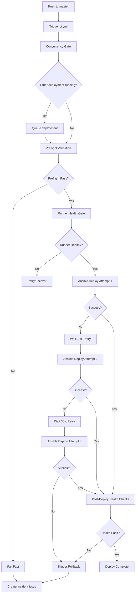

# Production Deployment Pipeline

This file documents the GitHub Actions-based production deployment pipeline and its integration with self-hosted runners.

## Purpose

- Automate production deployments from master branch
- Ensure reliable deployments with automatic failover and retry
- Provide comprehensive health checks and rollback capability
- Maintain deployment audit trail and monitoring

## Pipeline Architecture

### Workflow: `.github/workflows/ci.yml`

**Job**: `deploy-to-production`
- **Trigger**: Push to master branch or manual workflow_dispatch
- **Environment**: production (GitHub Environment protection)
- **Concurrency**: Serialized via `production-deployment` group
- **Runner Selection**: Primary runner with automatic secondary failover

### Concurrency Control (T026)

**Purpose**: Prevent concurrent production deployments that could cause race conditions or inconsistent state.

```yaml
concurrency:
  group: production-deployment
  cancel-in-progress: false  # Queue deployments, don't cancel
```

**Behavior**:
- Only ONE production deployment can run at a time
- Additional deployments are queued (not cancelled)
- Queued deployments wait for current deployment to complete
- No user intervention required for queueing

**Rationale**:
- Production state changes must be atomic (no partial/overlapping deploys)
- Rollback logic requires known-good state (can't rollback mid-deploy)
- Database migrations must complete before next deployment
- Service restarts must complete before health checks

### Runner Selection and Failover (T027)

**Primary Runner Configuration**:
```yaml
runs-on: [self-hosted, production, primary]
```

**Failover Behavior**:
- GitHub Actions automatically selects runner matching labels
- If primary runner offline: GitHub tries secondary runner with `[self-hosted, production, secondary]` labels
- No manual intervention or workflow changes required
- Failover latency: ≤30s (GitHub built-in retry + runner polling)

**Runner Health Gate (T029)**:
- Before deployment execution: query Prometheus for runner health metrics
- Check runner_status==1, runner_cpu<90%, runner_memory<90%
- If runner unhealthy: fail fast and retry on secondary
- Log runner selection decision to GITHUB_STEP_SUMMARY

### Deployment Stages

#### Stage 1: Preflight Validation (T028)

**Purpose**: Validate prerequisites before starting deployment to fail fast on configuration errors.

**Checks**:
1. **Secrets Validation**: PRODUCTION_SSH_PRIVATE_KEY, PRODUCTION_SSH_USER present
2. **Runner Health**: Query Prometheus for runner_status (must be 1/online)
3. **Artifact Availability**: Backend and frontend images built from previous job
4. **Resource Check**: Runner has sufficient disk space for deployment

**Output**: Markdown summary to GITHUB_STEP_SUMMARY with ✅/❌/⚠️ indicators

**Failure Handling**: Exit deployment immediately if critical checks fail (no retry)

#### Stage 2: Ansible Deployment (T030, T031)

**Idempotent Deployment**:
- Check current production version from state file `/var/lib/paws360-production-state.json`
- Skip deployment if target version already deployed (idempotent)
- Use `ansible-playbook --check --diff` dry-run before real execution
- Update production state file with deployment metadata:
  ```json
  {
    "current_version": "backend_image:tag",
    "previous_version": "previous_tag",
    "last_deploy_timestamp": "2025-12-10T10:30:00Z",
    "deploy_start": "2025-12-10T10:25:00Z",
    "deploy_runner": "production-runner-01",
    "deployed_by": "github-actions"
  }
  ```

**Retry Logic (T030)**:
- Use `nick-fields/retry@v3` action for automatic retry
- Max attempts: 3 (1 initial + 2 retries)
- Retry wait: 30s between attempts
- Timeout: 600s (10 minutes) per attempt

**Deployment Command**:
```bash
cd infrastructure/ansible
printf 'y\n' | ./deploy.sh deploy production "backend_image=$BACKEND_IMAGE frontend_image=$FRONTEND_IMAGE"
```

#### Stage 3: Post-Deployment Health Checks (T032)

**Comprehensive Health Validation**:
- Backend `/actuator/health` returns 200 with status=UP
- Frontend `/` returns 200
- Frontend `/api/health` returns 200
- Database connectivity check via backend `/actuator/health/db`
- Redis connectivity check via `redis-cli ping`
- External API reachability (SAML IdP if configured)
- Nginx proxying validated (frontend and backend routes)
- System resources: disk <90%, memory <95%

**Health Check Script**: `infrastructure/ansible/roles/deployment/tasks/post-deploy-health-checks.yml`

**Failure Handling**: If health checks fail → trigger automatic rollback

#### Stage 4: Rollback on Failure (T030)

**Triggered When**:
- All retry attempts exhausted (3 failures)
- Health checks fail after deployment
- Manual cancellation during deployment

**Rollback Procedure**:
```bash
ansible-playbook -i inventories/production/hosts playbooks/rollback-production.yml
```

**Rollback Actions**:
1. Query last known-good version from production state file
2. Restore previous version artifacts (backend, frontend images)
3. Restart services with previous configuration
4. Validate health checks pass for previous version
5. Create incident issue with label `production-rollback`

**Incident Issue Creation**:
- Automatic GitHub issue created with label `production-incident`
- Assignee: @oncall-sre
- Contains: workflow run URL, commit SHA, runner name, failure details
- Links to runbook: `docs/runbooks/production-deployment-failures.md`

### Monitoring and Observability

**Prometheus Metrics** (pushed after deployment):
- `deployment_duration_seconds{environment="production"}` - deployment time
- `deployment_success_total{environment="production"}` - successful deploys
- `deployment_failures_total{environment="production"}` - failed deploys
- `deployment_rollback_total{environment="production"}` - automatic rollbacks

**Grafana Dashboard**: `monitoring/grafana/dashboards/deployment-pipeline.json`
- Deployment success/failure rate
- Deployment duration trends (p50, p95, p99)
- Runner selection distribution (primary vs secondary)
- Rollback frequency and reasons

**Alerting**:
- `DeploymentFailureRateHigh`: >3 failures/hour
- `DeploymentDurationHigh`: >10 minutes
- `DeploymentRollbackTriggered`: any automatic rollback

### Deployment Workflow



## Configuration Files

### Ansible Inventory
- **File**: `infrastructure/ansible/inventories/production/hosts`
- **Groups**: `webservers`, `databases`, `redis`
- **Variables**: Backend/frontend image tags, service ports

### Ansible Playbooks
- `site.yml` - Main deployment playbook
- `playbooks/rollback-production.yml` - Rollback procedure
- `playbooks/validate-production-deploy.yml` - Pre-deployment validation

### GitHub Secrets
- `PRODUCTION_SSH_PRIVATE_KEY` - SSH key for Ansible connections
- `PRODUCTION_SSH_USER` - SSH user (default: admin)
- `AUTO_DEPLOY_TO_PRODUCTION` - Enable/disable automatic deploy (must be "true")
- `SLACK_WEBHOOK` - Notification webhook (optional)

## Operational Procedures

### Manual Deployment Trigger

```bash
# Via GitHub CLI
gh workflow run ci.yml --ref master

# Via GitHub Actions UI
# Navigate to Actions → CI workflow → Run workflow → Select master branch
```

### Emergency Rollback

```bash
# Automatic rollback (via workflow failure) - preferred
# No manual action needed, triggered by deployment failure

# Manual rollback (emergency only)
cd infrastructure/ansible
ansible-playbook -i inventories/production/hosts playbooks/rollback-production.yml
```

### Deployment Status Check

```bash
# Check production version
ssh production-web-01 "cat /var/lib/paws360-production-state.json" | jq

# Check service health
ssh production-web-01 "curl -sf http://localhost:8080/actuator/health" | jq

# Check runner status
curl -s "http://192.168.0.200:9090/api/v1/query" \
  --data-urlencode 'query=runner_status{environment="production"}' | jq
```

### Disable Deployments (Emergency)

```bash
# Method 1: Remove AUTO_DEPLOY_TO_PRODUCTION secret (via GitHub UI)
# Deployments will dry-run but not execute

# Method 2: Disable both runners
ssh production-runner-01 "sudo systemctl stop actions.runner.paws360-runner-01.service"
ssh production-runner-02 "sudo systemctl stop actions.runner.paws360-runner-02.service"
```

## Troubleshooting

### Deployment Stuck in Queue

**Symptom**: Deployment queued indefinitely, not starting
**Causes**:
- Previous deployment running or stuck
- Concurrency group locked
**Resolution**:
1. Check GitHub Actions UI for running workflows
2. Cancel stuck workflow if necessary
3. Re-trigger deployment

### Preflight Validation Failing

**Symptom**: Deployment fails at preflight stage
**Common Causes**:
- Secrets missing or expired
- Runner offline or degraded
- Artifact images not built
**Resolution**: See runbook `docs/runbooks/production-deployment-failures.md`

### Health Checks Failing After Deploy

**Symptom**: Deployment completes but health checks fail, triggering rollback
**Causes**:
- Service startup slow (increase timeout)
- Database migration failed
- Configuration error
**Resolution**:
1. Check service logs on production hosts
2. Verify database migration status
3. Review rollback logs for restoration success

### Rollback Not Restoring Service

**Symptom**: Automatic rollback executed but service still degraded
**Causes**:
- Previous version artifacts missing
- Database migration not reversible
**Resolution**:
1. Manually check production state file for last known-good version
2. Re-run rollback playbook with explicit version: `ansible-playbook playbooks/rollback-production.yml -e target_version=$VERSION`
3. Escalate to on-call if manual rollback fails

## Security

### Deployment Authorization
- Only master branch triggers production deploy
- GitHub Environment protection requires approval for workflow_dispatch
- All deployments logged with user, timestamp, commit SHA

### Secret Rotation
- Production SSH key rotated quarterly
- Rotation procedure documented in `docs/runbooks/production-secret-rotation.md`

### Audit Trail
- All deployments logged to production state file
- Workflow run logs retained 90 days
- Rollback events logged to monitoring

## Related Documentation

- JIRA: INFRA-472 (Epic), INFRA-473 (User Story 1)
- Spec: `specs/001-github-runner-deploy/spec.md`
- Context: `contexts/infrastructure/github-runners.md`
- Runbooks: `docs/runbooks/production-deployment-failures.md`

## Recent Changes

- 2025-12-10: Created context file with concurrency control, failover documentation, and rollback/idempotent deployment procedures for INFRA-473 (T037)
