# PAWS360 Platform Architecture Overview

## Executive Summary

PAWS360 is a comprehensive educational technology platform designed to modernize student information systems at the University of Wisconsin-Milwaukee. This document provides a high-level architectural overview of the platform, illustrating how components interact and how team members' work fits into the overall system.

## Platform Vision

```
PAWS360 transforms legacy student systems into a modern, scalable platform that:

🎓 Serves 25,000+ students with reliable, fast access to academic information
🏛️ Maintains FERPA compliance while enabling innovative educational tools
⚡ Provides 99.9% uptime with sub-second response times
🔧 Offers developer-friendly APIs and comprehensive documentation
🌐 Supports seamless integration with existing university systems
```

## High-Level Architecture

```mermaid
graph TB
    subgraph "User Layer"
        A[Students] --> B[Web Browsers]
        C[Faculty/Staff] --> B
        D[Administrators] --> B
        E[External Systems] --> F[APIs]
    end

    subgraph "Presentation Layer"
        B --> G[AdminLTE Dashboard]
        B --> H[Admin UI (Astro)]
        F --> I[REST APIs]
    end

    subgraph "Application Layer"
        G --> J[Spring Boot Backend]
        H --> J
        I --> J
        J --> K[JWT Authentication]
        J --> L[SAML2 Federation]
    end

    subgraph "Data Layer"
        J --> M[(PostgreSQL<br/>Primary DB)]
        J --> N[(Redis<br/>Sessions/Cache)]
        K --> O[(Auth DB)]
    end

    subgraph "Integration Layer"
        J --> P[PeopleSoft<br/>Legacy Systems]
        J --> Q[JIRA<br/>Project Management]
        J --> R[Azure AD<br/>Identity Provider]
    end

    subgraph "Infrastructure Layer"
        M --> S[Docker Containers]
        N --> S
        J --> S
        S --> T[Ansible<br/>Automation]
        S --> U[Prometheus<br/>Monitoring]
        S --> V[Grafana<br/>Visualization]
    end

    subgraph "Development Layer"
        W[Mock Services] --> J
        X[JIRA MCP Server] --> Q
        Y[Testing Suite] --> J
    end

    style A fill:#e1f5fe
    style C fill:#e1f5fe
    style D fill:#e1f5fe
    style G fill:#fff3e0
    style H fill:#fff3e0
    style J fill:#c8e6c9
    style M fill:#ffebee
    style N fill:#ffebee
    style S fill:#f3e5f5
    style W fill:#e8f5e8
```

## Component Breakdown

### 🎭 Presentation Layer

#### AdminLTE Dashboard
**Purpose**: Professional admin interface for system management and data visualization
**Technologies**: AdminLTE 4.0, Bootstrap 5, Chart.js, DataTables
**Key Features**:
- Real-time dashboards and analytics
- Data management interfaces
- User administration tools
- Reporting and visualization

#### Admin UI (Astro)
**Purpose**: Modern, accessible web interface for end-users
**Technologies**: Astro, TypeScript, AdminLTE, WCAG 2.1 AA
**Key Features**:
- Static site generation for performance
- Component-based architecture
- Accessibility compliance
- SEO optimization

### 💻 Application Layer

#### Spring Boot Backend
**Purpose**: Enterprise-grade business logic and API services
**Technologies**: Java 21, Spring Boot 3.x, Spring Security
**Key Features**:
- RESTful API design
- SAML2 authentication integration
- Database abstraction with JPA
- Caching and session management

#### Authentication Services
**Purpose**: Secure user authentication and authorization
**Technologies**: JWT, SAML2, Spring Security, Redis
**Key Features**:
- Multi-protocol authentication (SAML2, JWT)
- Session management and caching
- Role-based access control
- Integration with Azure AD

### 🗄️ Data Layer

#### PostgreSQL (Primary Database)
**Purpose**: Persistent data storage for application data
**Features**:
- Student information and records
- Course and enrollment data
- User profiles and permissions
- Audit logs and system data

#### Redis (Cache & Sessions)
**Purpose**: High-performance caching and session storage
**Features**:
- User session management
- API response caching
- Temporary data storage
- Pub/sub messaging

### 🔗 Integration Layer

#### Legacy System Integration
**Purpose**: Seamless connection with existing university systems
**Systems**:
- PeopleSoft (Student Information System)
- JIRA (Project Management)
- Azure AD (Identity Management)
- Other university services

#### API Gateway
**Purpose**: Unified API access and management
**Features**:
- Request routing and load balancing
- Authentication and authorization
- Rate limiting and throttling
- API versioning and documentation

## Development Workflow Architecture

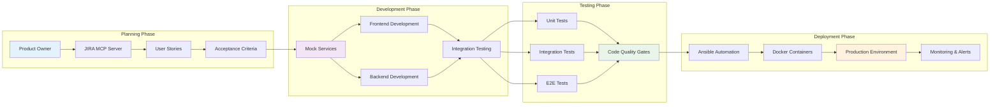

## Team Member Workflow Integration

### Frontend Developer Journey

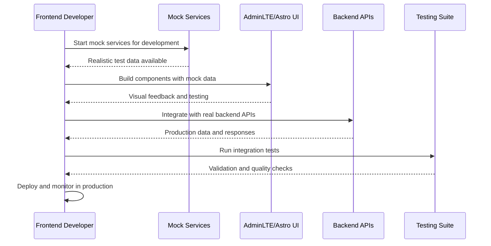

### Backend Developer Journey

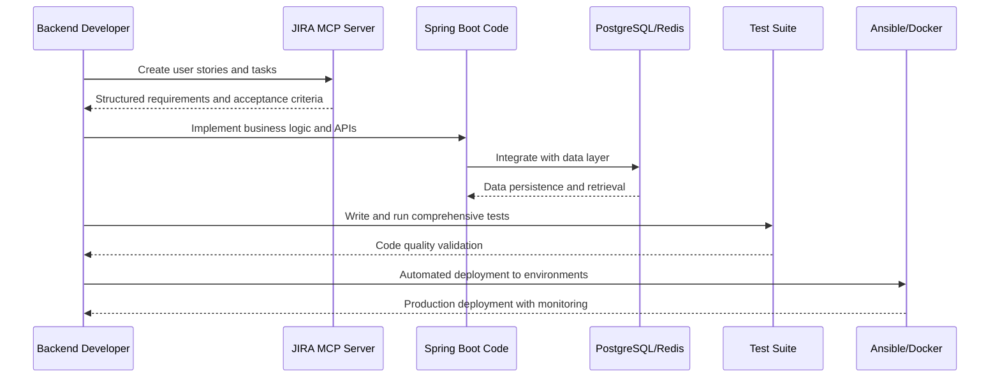

### DevOps Engineer Journey

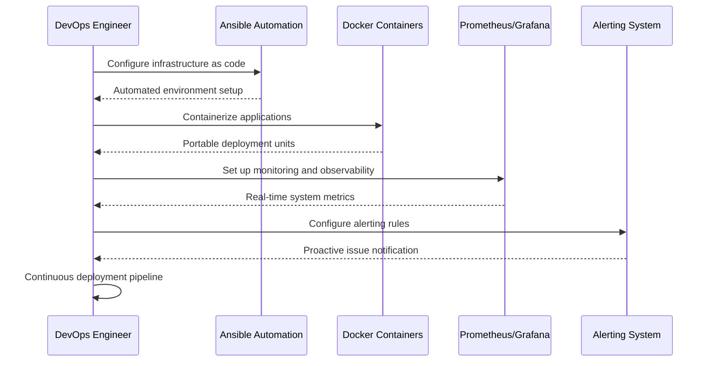

## Data Flow Architecture

### User Authentication Flow

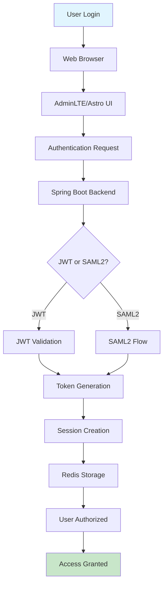

### API Request Flow

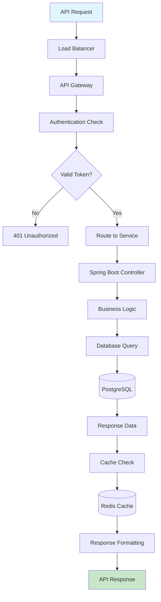

## Deployment Architecture

### Development Environment

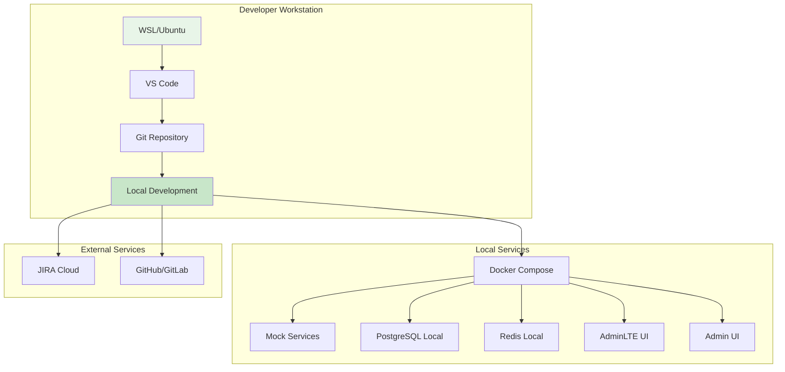

### Production Environment

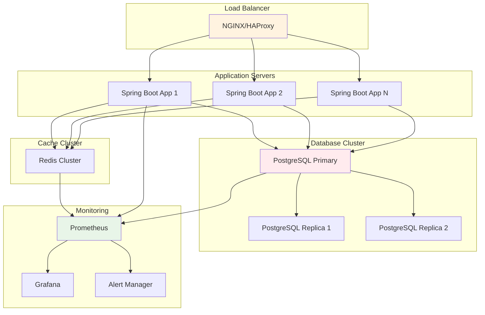

## Security Architecture

### Defense in Depth

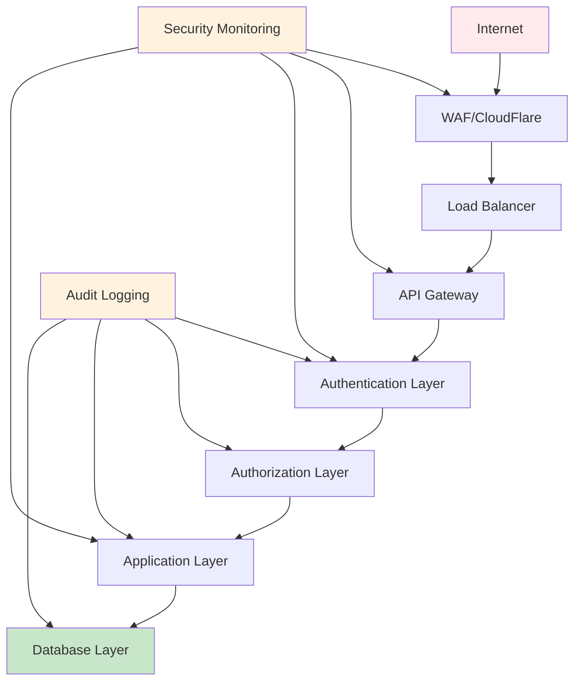

### Security Controls

| Layer | Security Controls | Implementation |
|-------|------------------|----------------|
| **Network** | WAF, DDoS protection, SSL/TLS | CloudFlare, NGINX |
| **Application** | Input validation, XSS prevention, CSRF protection | Spring Security, OWASP |
| **Authentication** | Multi-factor auth, SAML2, JWT | Azure AD, Spring Security |
| **Authorization** | Role-based access, API permissions | Spring Security, OAuth2 |
| **Data** | Encryption at rest, FERPA compliance | PostgreSQL encryption, audit logs |
| **Monitoring** | Security event monitoring, alerting | Prometheus, ELK stack |

## Performance Architecture

### Caching Strategy

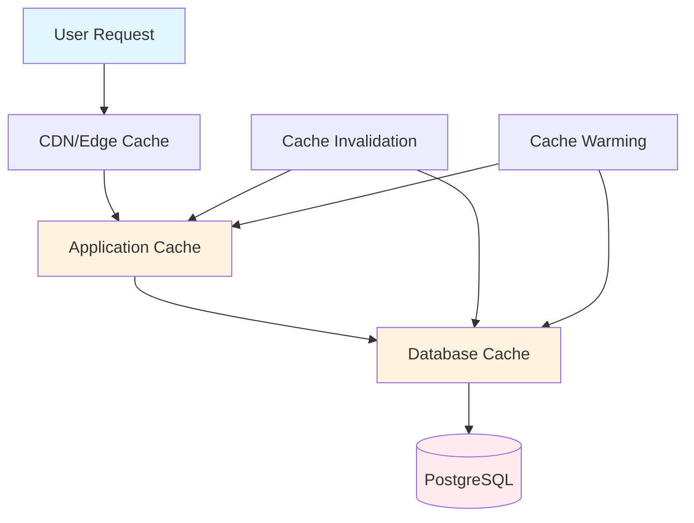

### Scalability Patterns

- **Horizontal Scaling**: Application servers can be added dynamically
- **Database Sharding**: Data partitioned across multiple database instances
- **Microservices**: Independent deployment and scaling of services
- **CDN Integration**: Static content delivered globally
- **Auto-scaling**: Infrastructure scales based on demand

## Monitoring and Observability

### Observability Stack

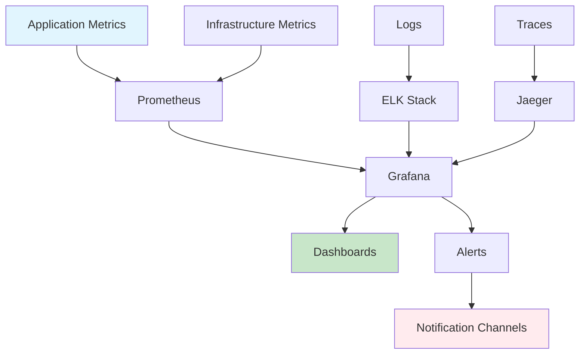

### Key Metrics

| Category | Metrics | Purpose |
|----------|---------|---------|
| **Performance** | Response time, throughput, error rate | System performance monitoring |
| **Business** | User logins, API calls, feature usage | Business KPI tracking |
| **Infrastructure** | CPU, memory, disk, network | Resource utilization |
| **Security** | Failed logins, suspicious activity | Security incident detection |
| **Availability** | Uptime, SLA compliance | Service reliability |

## Development Environment Architecture

### Local Development Setup

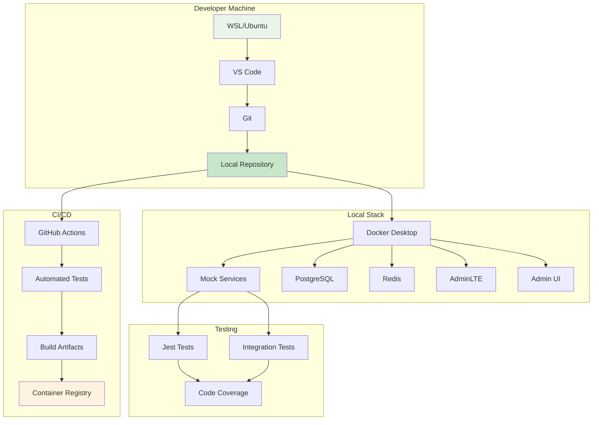

## Integration Patterns

### API Integration Patterns

1. **RESTful APIs**: Standard HTTP methods with JSON payloads
2. **GraphQL**: Flexible query interface for complex data needs
3. **Webhooks**: Event-driven integration with external systems
4. **Message Queues**: Asynchronous processing with RabbitMQ/Redis
5. **File Transfer**: Secure FTP/SFTP for bulk data operations

### System Integration Examples

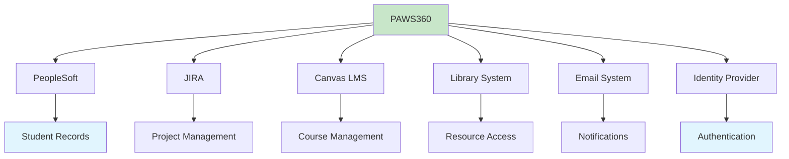

## Technology Stack Summary

### Frontend Technologies
- **Frameworks**: Astro, React (AdminLTE), Vue.js (future)
- **Languages**: TypeScript, JavaScript ES6+
- **Styling**: Bootstrap 5, CSS3, SCSS
- **Build Tools**: Vite, Webpack, Rollup

### Backend Technologies
- **Framework**: Spring Boot 3.x
- **Language**: Java 21 LTS
- **Security**: Spring Security, JWT, SAML2
- **API**: RESTful, OpenAPI 3.0

### Data Technologies
- **Primary Database**: PostgreSQL 15+
- **Cache**: Redis 7+
- **Search**: Elasticsearch (future)
- **ORM**: JPA/Hibernate

### Infrastructure Technologies
- **Containerization**: Docker, Docker Compose
- **Orchestration**: Kubernetes (future)
- **Automation**: Ansible
- **Monitoring**: Prometheus, Grafana
- **Logging**: ELK Stack

### Development Technologies
- **Version Control**: Git, GitHub/GitLab
- **CI/CD**: GitHub Actions, Jenkins
- **Testing**: JUnit, Jest, Cypress
- **Documentation**: Markdown, OpenAPI
- **Communication**: Slack, Microsoft Teams

## Migration Strategy

### From Legacy to Modern

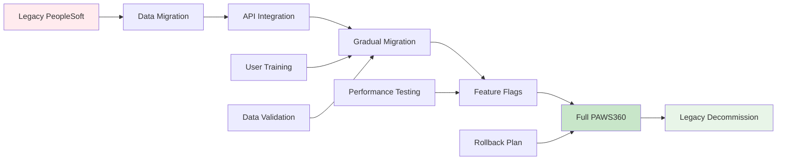

### Migration Phases

1. **Phase 1**: Data migration and API integration
2. **Phase 2**: Parallel operation with feature flags
3. **Phase 3**: Gradual user migration with training
4. **Phase 4**: Full production cutover
5. **Phase 5**: Legacy system decommissioning

## Conclusion

The PAWS360 platform architecture provides a solid foundation for modern educational technology while maintaining compatibility with existing systems. The modular design allows team members to work independently on components while ensuring seamless integration and deployment.

Key architectural principles:
- **Scalability**: Horizontal scaling and microservices design
- **Security**: Defense in depth with comprehensive security controls
- **Observability**: Complete monitoring and alerting capabilities
- **Developer Experience**: Comprehensive tooling and automation
- **Compliance**: FERPA and accessibility compliance built-in

This architecture supports the platform's goals of transforming student information systems while providing an excellent developer experience and operational excellence.

---

*PAWS360 Architecture Overview - Version 1.0.0*  
*Last Updated: September 20, 2025*  
*Document Status: Production Ready*</content>
<parameter name="filePath">/home/ryan/repos/PAWS360ProjectPlan/docs/architecture-overview.md