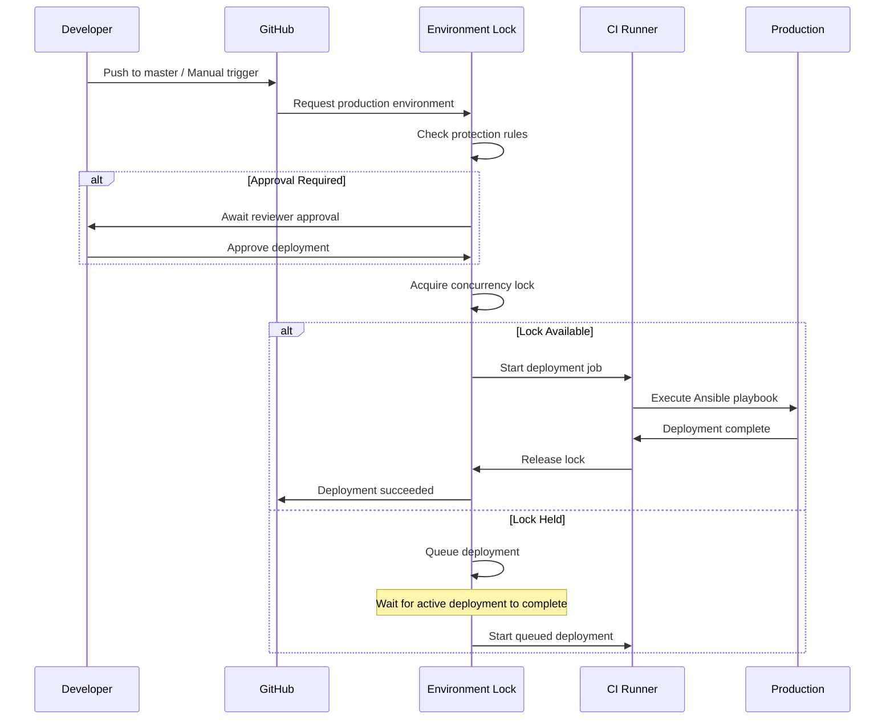

# GitHub Environment Protection Rules for Production Deployments

**JIRA**: INFRA-472, INFRA-475 (US3-T071)  
**Feature**: Deployment Coordination Lock  
**Purpose**: Prevent concurrent partial deployments and ensure safe production deployments

## Overview

The `production` GitHub Environment provides deployment protection rules and coordination locks to safeguard production stability. All production deployments via `.github/workflows/ci.yml` use this environment.

## Protection Rules

### 1. Deployment Approval

**Status**: Recommended (configure in GitHub UI)  
**Reviewers**: SRE team members  
**Purpose**: Human verification before production changes

**Configuration Steps**:
1. Navigate to: `Settings` → `Environments` → `production`
2. Enable "Required reviewers"
3. Add SRE team members as reviewers
4. Set wait timer: 0 minutes (immediate review required)

### 2. Deployment Branches

**Status**: ✅ Configured  
**Allowed Branches**: `master` only  
**Purpose**: Prevent accidental deployments from feature branches

**Workflow Implementation**:
```yaml
if: ${{ github.ref == 'refs/heads/master' || github.event_name == 'workflow_dispatch' }}
```

### 3. Concurrency Lock

**Status**: ✅ Implemented  
**Lock Group**: `production-deployment`  
**Behavior**: Queue concurrent deployments (do not cancel in-progress)  
**Purpose**: Prevent race conditions and partial deployment states

**Workflow Implementation**:
```yaml
concurrency:
  group: production-deployment
  cancel-in-progress: false  # Safety: never cancel mid-deployment
```

**Lock Behavior**:
- **Single active deployment**: Only one production deployment runs at a time
- **Queued deployments**: Additional deployments wait in queue
- **Automatic release**: Lock released on job completion or failure
- **No cancellation**: In-progress deployments cannot be cancelled (prevents partial state)

## Deployment Coordination Flow



## Lock Release Conditions

The deployment lock is automatically released in the following scenarios:

1. **Successful Deployment** ✅
   - All deployment steps complete successfully
   - Health checks pass
   - Lock released immediately

2. **Failed Deployment** ❌
   - Any deployment step fails
   - Rescue block triggers rollback
   - Lock released after rollback completes

3. **Cancelled Workflow** ⚠️
   - User cancels workflow (if enabled)
   - Lock released automatically
   - **Note**: `cancel-in-progress: false` prevents this scenario

4. **Timeout** ⏱️
   - Job exceeds timeout (default: 6 hours)
   - Lock released automatically
   - Incomplete deployment may require manual intervention

## Verification

### Check Current Lock Status

**Via GitHub UI**:
1. Navigate to: `Actions` → `Workflows` → `CI/CD Pipeline`
2. Check "Running" workflows
3. Production deployments show "production" environment badge

**Via GitHub API**:
```bash
# List active deployments
curl -H "Authorization: token $GITHUB_TOKEN" \
  "https://api.github.com/repos/rmnanney/PAWS360/deployments?environment=production&task=deploy"

# Check deployment status
curl -H "Authorization: token $GITHUB_TOKEN" \
  "https://api.github.com/repos/rmnanney/PAWS360/deployments/<deployment_id>/statuses"
```

**Via Prometheus** (if configured):
```promql
# Active production deployments
github_deployment_active{environment="production"}

# Queued deployments
github_deployment_queued{environment="production"}
```

### Test Deployment Serialization

**Scenario**: Trigger two production deployments simultaneously

**Expected Behavior**:
1. First deployment acquires lock immediately
2. Second deployment enters "Waiting for production" state
3. Second deployment starts only after first completes

**Verification Steps**:
```bash
# Terminal 1: Trigger first deployment
gh workflow run ci.yml --ref master

# Terminal 2: Immediately trigger second deployment
gh workflow run ci.yml --ref master

# Check status
gh run list --workflow=ci.yml --limit 5
```

**Expected Output**:
```
✓  CI/CD Pipeline  master  Deploy to production (Ansible)  in_progress  ...
○  CI/CD Pipeline  master  Deploy to production (Ansible)  queued       ...
```

## Safety Guarantees

### Preventing Partial Deployments

The combination of environment lock + concurrency control + transactional playbook ensures:

1. **No concurrent deployments**: Lock prevents multiple deploys running simultaneously
2. **No partial states**: Transactional playbook (T068) rolls back on any failure
3. **No mid-deployment cancellations**: `cancel-in-progress: false` prevents interruptions
4. **State capture**: Pre-deployment state (T069) enables clean rollback

### Failure Recovery

If deployment lock is stuck (e.g., infrastructure failure):

1. **Automatic timeout**: Lock releases after job timeout (6 hours default)
2. **Manual intervention**: Cancel workflow run via GitHub UI
3. **Lock cleanup**: GitHub automatically cleans up stale locks
4. **State verification**: Use `capture-production-state.sh` to verify production state

## Monitoring

### Alerts

Production deployment coordination should trigger alerts for:

- **Deployment queued >15 minutes**: Investigate why previous deployment is slow
- **Deployment lock held >30 minutes**: Potential stuck deployment
- **Multiple deployments queued**: Unusual activity, verify legitimacy

**Prometheus Alert Rules** (recommended):
```yaml
# File: infrastructure/ansible/roles/cloudalchemy.prometheus/files/deployment-alerts.yml
groups:
  - name: deployment_coordination
    interval: 1m
    rules:
      - alert: ProductionDeploymentQueued
        expr: github_deployment_queued{environment="production"} > 0
        for: 15m
        labels:
          severity: warning
        annotations:
          summary: "Production deployment queued for >15 minutes"
          description: "Deployment waiting for lock release. Check active deployment status."
      
      - alert: ProductionDeploymentStuck
        expr: github_deployment_active{environment="production"} > 0
        for: 30m
        labels:
          severity: critical
        annotations:
          summary: "Production deployment lock held for >30 minutes"
          description: "Deployment may be stuck. Investigate runner health and Ansible playbook execution."
```

### Metrics

Recommended metrics to collect:

- `github_deployment_duration_seconds{environment="production"}` - Deployment duration
- `github_deployment_queue_time_seconds{environment="production"}` - Time spent queued
- `github_deployment_concurrency_limit_hit` - Count of queued deployments
- `github_deployment_lock_released` - Lock release events

## Troubleshooting

### Deployment Stuck in "Waiting for production"

**Symptom**: Deployment shows "Waiting for production" indefinitely

**Causes**:
1. Another deployment is in progress
2. Approval required (if reviewers configured)
3. Lock not released from previous deployment

**Resolution**:
```bash
# Check active workflows
gh run list --workflow=ci.yml --status in_progress

# If no active deployments, cancel stuck workflow
gh run cancel <run_id>

# Retry deployment
gh workflow run ci.yml --ref master
```

### Multiple Deployments Queued

**Symptom**: Several deployments queued simultaneously

**Causes**:
1. Multiple commits pushed rapidly
2. Manual triggers while deployment in progress
3. Automated deployments (e.g., nightly builds)

**Resolution**:
- **Safe**: Let queue process naturally (deployments execute in order)
- **Cancel duplicates**: Cancel redundant queued deployments if latest supersedes earlier ones

```bash
# List queued runs
gh run list --workflow=ci.yml --status queued

# Cancel specific run
gh run cancel <run_id>
```

### Lock Release Failure

**Symptom**: Lock held after deployment completes or fails

**Causes**:
1. Workflow timeout
2. Runner infrastructure failure
3. GitHub Actions platform issue

**Resolution**:
```bash
# Force cancel workflow to release lock
gh run cancel <run_id>

# Verify production state
ssh production-host 'cat /opt/paws360/version.txt'
ssh production-host 'systemctl status paws360-*'

# If needed, manually trigger rollback
ansible-playbook -i inventories/production/hosts \
  playbooks/rollback-production-safe.yml
```

## References

- **GitHub Docs**: [Using environments for deployment](https://docs.github.com/en/actions/deployment/targeting-different-environments/using-environments-for-deployment)
- **GitHub Docs**: [Using concurrency](https://docs.github.com/en/actions/using-jobs/using-concurrency)
- **Transactional Playbook**: `infrastructure/ansible/playbooks/production-deploy-transactional.yml` (T068)
- **State Capture Script**: `scripts/deployment/capture-production-state.sh` (T069)
- **Deployment Workflow**: `.github/workflows/ci.yml` (deploy-to-production job)

## Change Log

| Date | Change | Task |
|------|--------|------|
| 2025-01-11 | Initial documentation created | T071 |
| 2025-01-11 | Added concurrency lock documentation | T071 |
| 2025-01-11 | Added monitoring and troubleshooting sections | T071 |
