# 🚀 PAWS360 Team Onboarding Guide

## Welcome to PAWS360! 🎓

**Transforming Student Information Systems for the University of Wisconsin-Milwaukee**

Welcome to the PAWS360 project! This comprehensive onboarding guide will get you up and running with our modern educational technology platform. Whether you're a new developer, QA engineer, or DevOps specialist, this guide provides everything you need to become productive quickly.

---

## 🎯 **Quick Start Overview**

### **What is PAWS360?**
PAWS360 is a next-generation student information system that modernizes legacy educational platforms while maintaining FERPA compliance and providing exceptional user experiences. We're building the future of university administration with cutting-edge technology.

### **Key Technologies**
- **Frontend**: Astro + TypeScript, AdminLTE v4.0, React (planned for student interface)
- **Backend**: Java 21 + Spring Boot 3.x
- **Database**: PostgreSQL with Redis caching
- **Infrastructure**: Docker + Ansible automation
- **Authentication**: SAML2 + JWT with Azure AD integration
- **Routing**: Astro file-based routing (current), React Router (planned for student SPA)

### **Development Philosophy**
- **Quality First**: Comprehensive testing and security
- **Developer Experience**: Automated tooling and clear documentation
- **Scalability**: Cloud-native architecture ready for growth
- **Compliance**: FERPA and accessibility standards built-in

---

## 🗺️ **Platform Architecture at a Glance**

```mermaid
graph TB
    subgraph "👥 End Users"
        A[Students] --> B[Web Browsers]
        C[Faculty/Staff] --> B
        D[Administrators] --> B
    end

    subgraph "🌐 Presentation Layer"
        B --> E[AdminLTE Dashboard]
        B --> F[Admin UI (Astro)]
        G[APIs] --> H[Spring Boot Backend]
    end

    subgraph "⚙️ Application Layer"
        E --> H
        F --> H
        H --> I[JWT/SAML2 Auth]
        H --> J[Business Logic]
    end

    subgraph "💾 Data Layer"
        J --> K[(PostgreSQL)]
        J --> L[(Redis Cache)]
        I --> M[(Auth Database)]
    end

    subgraph "🔧 Development Layer"
        N[Mock Services] --> H
        O[JIRA MCP Server] --> P[JIRA]
        Q[Testing Suite] --> H
    end

    subgraph "🏗️ Infrastructure"
        K --> R[Docker]
        L --> R
        H --> R
        R --> S[Ansible Deploy]
        R --> T[Prometheus/Grafana]
    end

    style A fill:#e1f5fe
    style H fill:#c8e6c9
    style R fill:#f3e5f5
    style N fill:#e8f5e8
```

---

## 📚 **Your Learning Journey**

### **Phase 1: Environment Setup** (2 hours)
Get your development environment ready for PAWS360 development.

```mermaid
graph LR
    A[Install WSL/Ubuntu] --> B[Setup Development Tools]
    B --> C[Configure SSH/Git]
    C --> D[Clone Repository]
    D --> E[Install Dependencies]
    E --> F[Validate Setup]
    F --> G[🎉 Ready to Code!]
```



**📖 [Complete Setup Guide →](wsl-ubuntu-setup-guide.md)**

### **Phase 2: Understand the Platform** (1 hour)
Learn about PAWS360's services and architecture.


**📖 [Service Catalog →](service-catalog.md)** • **📖 [Architecture Overview →](architecture-overview.md)**

### **Phase 3: Start Contributing** (Ongoing)
Begin your development journey with hands-on tasks.


---

## 🛠️ **Available Services & Tools**

| Category | Services | Quick Access |
|----------|----------|--------------|
| **🤖 AI & Automation** | JIRA MCP Server, Ansible | [Service Catalog →](service-catalog.md) |
| **🎭 User Interfaces** | AdminLTE Dashboard, Admin UI (Astro) | [Services Overview →](services-overview.md) |
| **☕ Backend Services** | Spring Boot API, Auth Services | [Architecture →](architecture-overview.md) |
| **🐳 Infrastructure** | Docker, PostgreSQL, Redis | [Setup Guide →](wsl-ubuntu-setup-guide.md) |
| **📊 Monitoring** | Prometheus, Grafana | [Services Overview →](services-overview.md) |

---

## 🚀 **Getting Started Commands**

### **1. Start Everything**
```bash
# Full platform startup
./scripts/setup/paws360-services.sh start

# Or start individual services
cd mock-services && npm start          # Mock services
cd admin-dashboard && npm run dev      # AdminLTE UI
cd admin-ui && npm run dev            # Astro UI
```

### **2. Development Workflow**
```bash
# Create user stories
PYTHONPATH=src python -m cli serve

# Run tests
npm test
./scripts/testing/exhaustive-test-suite.sh

# Deploy changes
cd infrastructure/ansible
./deploy.sh deploy development
```

### **3. Health Checks**
```bash
# Check all services
./scripts/utilities/test_paws360_apis.sh

# Individual service checks
curl http://localhost:8081/health     # Auth service
curl http://localhost:8082/health     # Data service
curl http://localhost:3001           # AdminLTE dashboard
```

---

## 👥 **Team Roles & Responsibilities**

### **Frontend Developer**
- Build user interfaces with Astro/TypeScript
- Implement responsive designs with AdminLTE
- Ensure accessibility compliance (WCAG 2.1 AA)
- **Note**: Student interface will use React Router for SPA functionality (planned implementation)
- **Start with**: [Admin UI (Astro)](service-catalog.md#admin-ui-astro)

### **Backend Developer**
- Develop REST APIs with Spring Boot
- Implement authentication and authorization
- Design database schemas and queries
- **Start with**: [Spring Boot Backend](service-catalog.md#spring-boot-backend)

### **DevOps Engineer**
- Manage infrastructure with Ansible
- Monitor systems with Prometheus/Grafana
- Automate deployments and scaling
- **Start with**: [Ansible Automation](service-catalog.md#ansible-automation)

### **QA Engineer**
- Write comprehensive test suites
- Validate security and performance
- Test integrations and user flows
- **Start with**: [Mock Services](service-catalog.md#mock-services-suite)

---

## 📋 **Project Standards & Guidelines**

### **Code Quality**
- **Testing**: 80%+ coverage required
- **Security**: Security reviews for all auth features
- **Performance**: P95 < 200ms response times
- **Accessibility**: WCAG 2.1 AA compliance

### **Development Workflow**
- **Git Flow**: Feature branches with PR reviews
- **Documentation**: Update docs with code changes
- **Testing**: Tests pass before merge
- **Security**: Security scan before deployment

### **Communication**
- **JIRA**: Project management and user stories
- **GitHub**: Code reviews and issues
- **Slack/Teams**: Team communication
- **Documentation**: Always up-to-date

---

## 🎯 **Success Metrics**

### **Individual Success**
- ✅ Environment setup completed in < 2 hours
- ✅ First user story created and deployed
- ✅ Code review completed successfully
- ✅ Tests written and passing

### **Team Success**
- ✅ 99.9% uptime maintained
- ✅ P95 response times < 200ms
- ✅ FERPA compliance verified
- ✅ Zero security incidents

---

## 📞 **Getting Help**

### **Documentation**
- **[WSL Setup Guide](wsl-ubuntu-setup-guide.md)** - Complete environment setup
- **[Service Catalog](service-catalog.md)** - All services and features
- **[Architecture Overview](architecture-overview.md)** - System design and flow
- **[Services Overview](services-overview.md)** - Detailed service documentation

### **Team Support**
- **Tech Lead**: Architecture questions and code reviews
- **DevOps Lead**: Infrastructure and deployment issues
- **QA Lead**: Testing strategies and validation
- **Security Officer**: Compliance and security concerns

### **Community Resources**
- **JIRA MCP Server**: AI assistance for project management
- **Mock Services**: Safe environment for experimentation
- **GitHub Issues**: Bug reports and feature requests
- **Slack Channels**: Real-time team communication

---

## 🚀 **Next Steps**

### **Immediate Actions** (Today)
1. **Set up your environment** using the [WSL Setup Guide](wsl-ubuntu-setup-guide.md)
2. **Explore the platform** with the [Service Catalog](service-catalog.md)
3. **Start your first task** using the JIRA MCP Server

### **This Week**
1. **Complete environment validation** - Run all health checks
2. **Create your first user story** - Use JIRA MCP Server
3. **Submit your first PR** - Start contributing code
4. **Join team standup** - Connect with the team

### **This Month**
1. **Master your role** - Deep dive into your specialty area
2. **Contribute to architecture** - Understand system design
3. **Mentor others** - Help new team members
4. **Own a feature** - Take end-to-end responsibility

---

## 🎉 **Welcome to the Team!**

You're now equipped with everything needed to succeed on the PAWS360 project. Our platform serves 25,000+ students and faculty at UWM, and your contributions will directly impact their educational experience.

**Remember**: Quality first, collaboration always, and never stop learning. The PAWS360 team is here to support your growth and success.

**Ready to start building the future of education? Let's go! 🚀**

---

*PAWS360 Onboarding Guide - Version 1.0.0*  
*Last Updated: September 21, 2025*  
*Maintained by: PAWS360 Development Team*</content>
<parameter name="filePath">/home/ryan/repos/PAWS360ProjectPlan/docs/onboarding.md