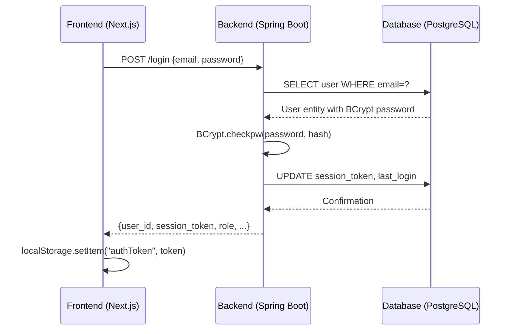
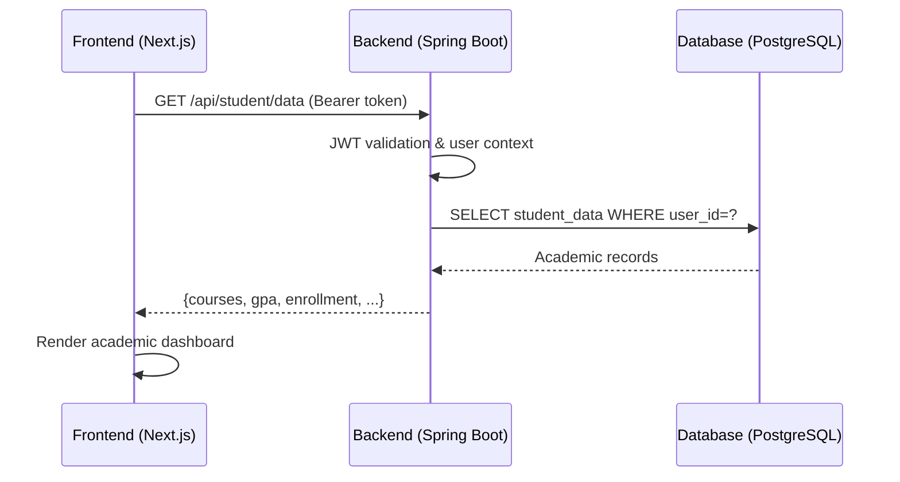

# Data Model: Repository Unification 

**Date**: November 6, 2024  
**Phase**: Phase 1 - Design & Architecture  
**Spec**: [001-unify-repos](./spec.md)

## Executive Summary

This data model preserves existing backend entities and frontend interfaces while defining the integration contracts needed for unified orchestration. **No database schema changes required** - focus is on API contracts and service coordination.

## Core Entity Preservation

### Existing Backend Data Model ✅

The Spring Boot backend contains a comprehensive data model that requires **no modifications**:

```java
// Core User Entity - PRESERVED
@Entity
public class Users {
    @Id @GeneratedValue
    private int id;
    
    // Identity & Contact
    private String firstname, lastname, email;
    private String preferred_name;
    private LocalDate dob;
    
    // Authentication  
    @JsonIgnore
    private String password;           // BCrypt encoded
    @JsonIgnore  
    private String session_token;      // JWT session management
    private LocalDateTime session_expiration;
    
    // Authorization & Compliance
    @Enumerated(EnumType.STRING)
    private Role role;                 // STUDENT, FACULTY, STAFF, ADMIN
    @Enumerated(EnumType.STRING) 
    private Status status;             // ACTIVE, INACTIVE, LOCKED
    @Enumerated(EnumType.STRING)
    private Ferpa_Compliance ferpa_compliance;
    
    // Security & Audit
    private int failed_attempts;
    private boolean account_locked;
    private LocalDateTime last_login;
    private LocalDate account_updated;
}
```

**Role Specializations** - All entities preserved:
- Student, Faculty, Staff, Admin (core roles)  
- Advisor, Counselor, Mentor, Professor, TA, Instructor (specialized roles)

## API Contract Definitions

### 🔐 Authentication Contracts

#### Login Endpoint (Existing - Validated)
```typescript
// Request Contract
interface LoginRequest {
  email: string;    // @uwm.edu validation enforced
  password: string; // Client-side required validation
}

// Response Contract  
interface LoginResponse {
  user_id: number;
  email: string;
  firstname: string;
  lastname: string;
  role: UserRole;
  status: UserStatus;
  session_token: string;        // JWT for API authentication
  session_expiration: string;   // ISO datetime
  message: string;              // "Login Successful" | error details
}

// HTTP Status Mapping
// 200 OK → Successful login
// 401 UNAUTHORIZED → Invalid credentials
// 423 LOCKED → Account locked due to failed attempts
```

**Integration Status**: ✅ Frontend `LoginForm/login.tsx` already implements this contract.

#### Session Management Contract
```typescript
// Session Validation (Header-based)
interface AuthHeaders {
  "Authorization": `Bearer ${session_token}`;
  "Content-Type": "application/json";
}

// Session Context (Frontend Storage)
interface SessionContext {
  authToken: string;        // localStorage key
  userEmail: string;        // User identifier  
  userFirstName: string;    // Display name
  userRole?: UserRole;      // Authorization context
}
```

### 👤 User Management Contracts

#### User Data Transfer Objects (Existing)
```typescript
// User Creation (Admin functionality)
interface CreateUserRequest {
  firstname: string;
  lastname: string; 
  email: string;           // @uwm.edu domain required
  role: UserRole;
  // Additional fields from existing DTO...
}

// User Response (Standard format)
interface UserResponse {
  id: number;
  firstname: string;
  lastname: string;
  email: string;
  role: UserRole;
  status: UserStatus;
  addresses?: AddressDTO[];
  // Excludes sensitive fields (password, session_token)
}
```

### 🎓 Academic Data Contracts

#### Student Portal Data (Preserved Existing Structure)
```typescript
// Student Academic Context
interface StudentAcademicData {
  student_id: number;       // Links to Users.id where role=STUDENT
  enrollment_status: string;
  current_semester: string;
  gpa?: number;
  major?: string;
  advisor_id?: number;      // Links to Users.id where role=ADVISOR
}

// Course Information (Existing entities preserved)
interface CourseData {
  course_id: number;
  course_code: string;      // e.g., "COMPSCI 361"
  course_name: string;
  credits: number;
  semester: string;
  instructor_id: number;    // Links to Users.id
}
```

### 🏛️ Administrative Contracts

#### Domain Value Lists (Existing endpoint: `/domains`)
```typescript
// Enumeration endpoints for form population
interface DomainEndpoints {
  "/domains/ethnicities": Ethnicity[];
  "/domains/genders": Gender[];  
  "/domains/nationalities": Nationality[];
  "/domains/states": US_States[];
}

// Used by frontend forms for dropdown population
```

## Service Integration Architecture

### 🌐 Frontend Service Layer

#### API Client Configuration
```typescript
// Environment-based configuration (NEW)
interface APIConfig {
  baseURL: string;          // Container networking support
  timeout: number;          // Request timeout
  retryAttempts: number;    // Resilience configuration  
}

// Development: http://localhost:8081
// Container: http://backend:8081  
// Production: https://api.paws360.uwm.edu
```

#### Service Abstraction Layer (Enhancement)
```typescript
// Centralized API service (NEW PATTERN)
class PAWS360ApiService {
  constructor(config: APIConfig) { /* ... */ }
  
  // Authentication
  async login(credentials: LoginRequest): Promise<LoginResponse>
  async logout(): Promise<void>
  async validateSession(): Promise<boolean>
  
  // User Management  
  async getCurrentUser(): Promise<UserResponse>
  async updateProfile(data: UserUpdateRequest): Promise<UserResponse>
  
  // Academic Data
  async getStudentData(): Promise<StudentAcademicData>
  async getCourses(): Promise<CourseData[]>
  
  // Domain Data
  async getDomainValues(domain: string): Promise<any[]>
}
```

### ⚙️ Backend Service Coordination

#### Health Check Contracts (NEW)
```java
// Service health monitoring
@RestController
@RequestMapping("/health")
public class HealthController {
    
    @GetMapping
    public ResponseEntity<HealthStatus> health() {
        // Database connectivity check
        // Authentication service check  
        // External dependency validation
        return ResponseEntity.ok(new HealthStatus("UP", checks));
    }
}

interface HealthStatus {
    String status;           // UP, DOWN, DEGRADED
    Map<String, Object> checks;
    Instant timestamp;
}
```

#### Configuration Profiles (Enhancement)
```yaml  
# application-container.yml (NEW)
spring:
  profiles:
    active: container
  datasource:
    url: jdbc:postgresql://database:5432/paws360
    username: ${DB_USER:paws360}
    password: ${DB_PASSWORD:secure_password}
  
server:
  port: 8081
  
cors:
  allowed-origins: 
    - http://frontend:3000
    - http://localhost:3000
```

## Database Integration Contracts

### 🗄️ PostgreSQL Service Configuration

#### Container Database Setup (Enhancement)
```sql
-- Database initialization (Enhanced from existing)
-- File: infrastructure/docker/db/init.sql

-- Create application database
CREATE DATABASE paws360;
CREATE USER paws360_app WITH ENCRYPTED PASSWORD 'secure_password';
GRANT ALL PRIVILEGES ON DATABASE paws360 TO paws360_app;

-- Create read-only user for reporting/analytics
CREATE USER paws360_readonly WITH ENCRYPTED PASSWORD 'readonly_password';  
GRANT CONNECT ON DATABASE paws360 TO paws360_readonly;
GRANT USAGE ON SCHEMA public TO paws360_readonly;
GRANT SELECT ON ALL TABLES IN SCHEMA public TO paws360_readonly;
```

#### Seed Data Management (Enhancement)
```sql
-- Idempotent demo data loading
-- File: infrastructure/docker/db/seed-demo.sql

-- Demo users (deterministic for testing)
INSERT INTO users (firstname, lastname, email, password, role, status) 
VALUES 
  ('Demo', 'Student', 'student@uwm.edu', '$2a$10$...', 'STUDENT', 'ACTIVE'),
  ('Demo', 'Faculty', 'faculty@uwm.edu', '$2a$10$...', 'FACULTY', 'ACTIVE'),  
  ('Demo', 'Admin', 'admin@uwm.edu', '$2a$10$...', 'ADMIN', 'ACTIVE')
ON CONFLICT (email) DO UPDATE SET 
  password = EXCLUDED.password,
  status = EXCLUDED.status;
```

## Integration Data Flow

### 📊 Authentication Flow


### 📊 Protected Resource Access


## Security & Compliance Data Model

### 🔒 Session Security
```typescript
// Enhanced session management
interface SecurityContext {
  session_token: string;      // JWT with expiration
  issued_at: number;          // Unix timestamp  
  expires_at: number;         // Auto-logout timing
  last_activity: number;      // Idle timeout tracking
  ip_address?: string;        // Security audit
  user_agent?: string;        // Device tracking
}

// FERPA Compliance Context (Preserved)
interface FERPAContext {
  ferpa_compliance: 'RESTRICTED' | 'LIMITED' | 'FULL';
  directory_opt_in: boolean;
  photo_release: boolean;
  contact_preferences: {
    phone: boolean;
    email: boolean; 
    mail: boolean;
  };
}
```

### 🛡️ Audit & Compliance
```java
// Enhanced audit logging (NEW)
@Entity
public class AuditLog {
    @Id @GeneratedValue
    private Long id;
    
    private int user_id;              // Actor
    private String action;            // LOGIN, LOGOUT, DATA_ACCESS
    private String resource;          // Table/endpoint accessed
    private String ip_address;        // Security context
    private LocalDateTime timestamp;  // Compliance requirement
    private String details;           // JSON payload of changes
}
```

## Environment Configuration Matrix

### 🔧 Service Configuration

| Environment | Frontend URL | Backend URL | Database URL |
|-------------|--------------|-------------|--------------|
| Development | localhost:3000 | localhost:8081 | localhost:5432 |
| Container | frontend:3000 | backend:8081 | database:5432 |  
| Production | https://paws360.uwm.edu | https://api.paws360.uwm.edu | private-db:5432 |

### 📝 Demo Configuration
```yaml
# Demo-specific settings
demo:
  accounts:
    - email: "demo.student@uwm.edu"
      password: "student123"  
      role: "STUDENT"
    - email: "demo.faculty@uwm.edu" 
      password: "faculty123"
      role: "FACULTY"
  
  reset_on_startup: true
  session_duration: "2h"
  auto_populate_data: true
```

## API Documentation & Testing

### 📋 OpenAPI Specification (NEW)
```yaml
openapi: 3.0.0
info:
  title: PAWS360 API
  version: 1.0.0
  description: Student Information System API

paths:
  /login:
    post:
      summary: User authentication
      requestBody:
        content:
          application/json:
            schema:
              $ref: '#/components/schemas/LoginRequest'
      responses:
        '200':
          description: Login successful
          content:
            application/json:
              schema:
                $ref: '#/components/schemas/LoginResponse'
```

### 🧪 Contract Testing (NEW)
```typescript  
// API contract validation tests
describe('PAWS360 API Contracts', () => {
  test('Login endpoint contract compliance', async () => {
    const response = await api.post('/login', validCredentials);
    expect(response.data).toMatchSchema(LoginResponseSchema);
  });
  
  test('User data contract compliance', async () => {
    const response = await authenticatedApi.get('/users/profile');  
    expect(response.data).toMatchSchema(UserResponseSchema);
  });
});
```

## Next Steps → Implementation

### Phase 2 Preparation

1. **Service Configuration** → Environment files and Docker networking
2. **API Integration** → Frontend service layer implementation  
3. **Health Monitoring** → Endpoint creation and container orchestration
4. **Demo Automation** → Seed data and reset mechanisms

**Data Model Status**: ✅ **COMPLETE** - No schema changes required, integration contracts defined.

## Constitutional Compliance Re-Check

✅ **Library-First**: Existing entities preserved; new contracts enable independent testing  
✅ **CLI Interface**: Docker compose provides declarative service coordination  
✅ **Test-First**: API contracts define testable integration points  
✅ **Integration Testing**: Cross-service contracts enable end-to-end validation  
✅ **Observability**: Health check contracts and audit logging defined  
✅ **Simplicity**: Configuration-over-code approach; minimal new complexity